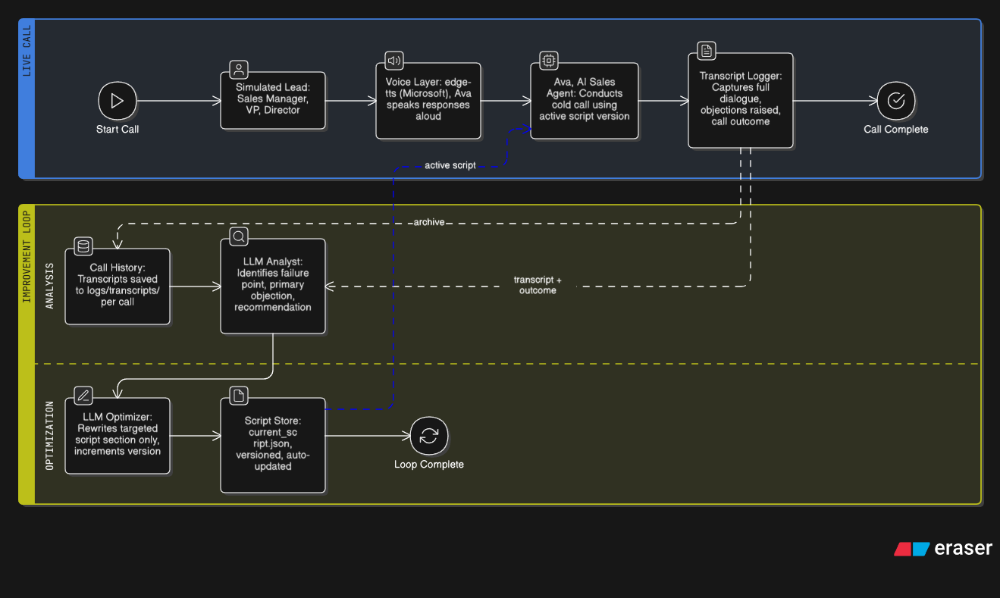
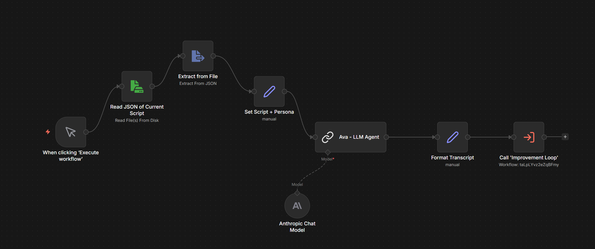
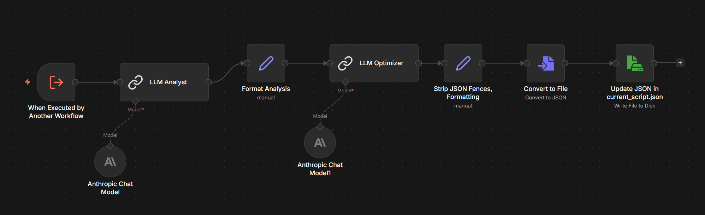

# Welcome and Meet Ava! Our SalesNest AI Cold Call Agent!

<p align="center">
  
</p>

An AI-powered cold calling agent named **Ava** that runs live sales calls, handles objections, and improves its own script after every call. *SalesNest is a fictional company offering a modern CRM.*

Built as a lightweight, end-to-end system using Claude (Sonnet 4.6), edge-tts, faster-whisper, and Flask; designed to simulate real SDR workflows without relying on expensive APIs.


---

## What It Does

- Ava cold-calls a simulated lead using a structured sales script
- You play the lead; respond by voice through the terminal or browser
- After each call, a two-step improvement loop analyzes what went wrong and rewrites only the failing part of the script
- The script version increments automatically after each optimization and is saved to disk
- If the call fails or stalls, the script is updated; if the call succeeds, the script is left unchanged.

For a full demo showing how the script improves across runs (fail → neutral → success), see `evaluation.md`.

---

## Project Structure

```
call_center_agent/
├── agent/
│   ├── prompts.py        # Persona loading, system prompt builder
│   ├── tts.py            # edge-tts voice output
│   ├── stt.py            # faster-whisper mic recording
│   └── improvement.py    # Post-call analysis + script optimizer
├── web/
│   ├── app.py            # Flask server
│   ├── templates/        # index.html
│   └── static/           # style.css, script.js, ava_bot.png
├── scripts/
│   ├── current_script.json   # Live script (auto-updated each call)
│   ├── personas.json         # Lead personas
│   └── versions/             # Versioned script history
├── prompts/              # Raw system prompt templates for Ava
├── n8n-workflows/        # Original orchestration workflow JSONs
├── logs/
│   └── transcripts/          # Per-call transcripts with analysis
├── images/               # Ava pixel art + architecture diagram
├── call_agent.py         # CLI entry point
├── requirements.txt
└── .env
```

---

## Setup

### 1. Clone and install

```bash
git clone https://github.com/jordanjasonclifford/call_center_agent.git
cd call_center_agent
python -m venv venv
source venv/bin/activate  # Windows: venv\Scripts\activate
pip install -r requirements.txt
```

### 2. Install ffmpeg

Required for audio conversion in the web interface; mainly for handling recorded audio cleanly.

- **Windows**: Download from [ffmpeg.org](https://ffmpeg.org/download.html) and add to PATH
- **Mac**: `brew install ffmpeg`
- **Linux**: `sudo apt install ffmpeg`

### 3. Setup your .ENV

```bash
cp .env.example .env
```

Then open `.env` and fill in your Anthropic API key. Best found at https://platform.claude.com/

---

## Running

### Web Interface (recommended)

```bash
cd web
python app.py
```

Open `http://localhost:5000` / 'http://127.0.0.1:5000/' in your browser. Select a lead persona, click **Start Call**, then hold the button to speak.

### Terminal (CLI)

```bash
python call_agent.py
```

Select a persona; press Enter to start and stop recording each turn.

---

## Architecture



---

## How the Improvement Loop Works

After every call ends, two Claude API calls run automatically:

1. **Analyst** — reads the transcript and identifies the failure point (`opener`, `discovery`, `value_pitch`, `objection_handler`, or `close`) and the primary objection raised
2. **Optimizer** — rewrites *only* the failing section of the script, increments `script_version`, and saves it back to `scripts/current_script.json`

A versioned snapshot is saved to `scripts/versions/script_vN.json` and the full transcript + analysis is logged to `logs/transcripts/`.

---

## Lead Personas

| Persona | Objection | Notes |
|---|---|---|
| **Jean Doe** | None | Blank slate — mirrors the caller's energy exactly |
| **Karen** | `already_have_crm` | Just renewed Salesforce, hostile, will not convert |
| **Devin** | `not_the_right_time` | Mid-quarter crunch, responds to urgency |
| **Rachel** | `too_expensive` | Budget-locked RevOps lead, analytical, numbers-focused |
| **Michael** | `send_info` | Polite deflector, evaluating three vendors |

---

## n8n Workflows

These workflows were the original orchestration foundation before the call and improvement logic was implemented directly in Python. n8n sequences each step as a connected node graph — each node is a discrete action (LLM call, file read/write) and the edges define the data flow; making the pipeline easy to follow and debug without digging through code like no tomorrow.

Two workflow JSONs are included in `n8n-workflows/` for import:

- **Call Execution** — triggers the call, passes the active script to the agent, and routes the outcome
- **Improvement Loop** — receives the transcript, runs the analyst and optimizer LLM calls in sequence, and writes the updated script back to disk

Import via n8n → Workflows → Import from file. Add your Anthropic API credentials in the credentials panel before activating.

**Call Execution**


**Improvement Loop**


---

## Self-Assessment

This project demonstrates a working self-improving call agent with a full feedback loop. Ava can simulate realistic sales conversations, handle objections, and iteratively refine its script based on actual outcomes. In practice, the improvement loop produces noticeable changes across iterations, especially in objection handling and closing.

There are still some limitations. Success is currently evaluated heuristically rather than through a formal scoring model or conversion metric. The system only updates one section per iteration, which keeps things stable but slows down convergence to a fully optimized script. Voice interaction works well locally, but latency and UX could be improved for a more production-ready setup.

If I were to extend this further, I would add quantitative evaluation (conversion likelihood, sentiment scoring), aggregate memory across multiple calls instead of single transcripts, and introduce a smarter update policy that can modify multiple sections when needed.

---

## Trade-offs & Design Decisions

Several trade-offs were made to balance cost, reliability, and speed of development:

**Claude (Sonnet 4.6) over fully free LLM options**  
Claude was chosen because it provides much stronger reasoning and more consistent outputs, especially for the Analyst → Optimizer loop. While it does cost money, using a higher-quality model here made the improvement step actually useful instead of noisy or inconsistent. I avoided using paid APIs in other parts of the system, so the cost is isolated to where it matters most. It was also simpler to work with compared to some free alternatives with unstable access or rate limits.

Each call uses N LLM calls during the conversation (one per Ava response turn), plus 2 fixed calls at the end for the improvement loop — one for the Analyst and one for the Optimizer. Total cost per call scales with conversation length but remains predictable.

**edge-tts over ElevenLabs**  
Chosen because it is completely free and requires no API key; ElevenLabs has better voice quality, but cost scales quickly and adds external dependency risk. For this project, edge-tts was more than good enough.

**faster-whisper (local STT) over cloud APIs**  
Running speech-to-text locally removes API cost and reduces latency; the trade-off is slightly lower accuracy compared to premium services, but it works well in controlled scenarios.

**Python improvement loop over n8n orchestration**  
n8n was initially used for workflow design, but a LangChain-related bug made it unreliable for iterative logic. Moving the loop into Python gave full control and made debugging much easier. n8n is still included to show intended orchestration design.

**Two-step loop vs full multi-agent system**  
The system uses a simple Analyst → Optimizer loop instead of multiple competing agents; this keeps behavior predictable and easier to debug, but limits exploration of alternative strategies.

**Section-level updates instead of full rewrites**  
Only rewriting the failing section prevents breaking parts of the script that already work; the downside is slower overall optimization.

---

## Business Impact & Real-World Value

A system like Ava maps directly to real-world sales workflows, especially for SDR teams doing cold outreach.

**Reduced training time**  
New reps usually take weeks to ramp; Ava can simulate realistic objection scenarios and continuously refine scripts, acting as a built-in training environment.

**Faster iteration on messaging**  
Instead of waiting on long A/B testing cycles, the system adapts after every call; identifying weak points and improving them immediately.

**Lower tooling costs**  
Many teams rely on expensive CRM and sales tools that often go underused; this shows how a lightweight AI system can replace or augment parts of that stack.

**Safe experimentation**  
Teams can test messaging strategies, objection handling, and pitch variations without risking real leads.

From a cost perspective, this setup is intentionally efficient:
- Local STT eliminates transcription costs  
- edge-tts removes TTS costs  
- LLM calls are the only cost — N calls during the conversation (one per Ava turn) plus 2 fixed calls for the improvement loop (Analyst + Optimizer)  

Overall, the system shows how an AI-driven sales agent can deliver real value without heavy infrastructure or high API spend.

---

## Tech Stack

| Component | Library |
|---|---|
| LLM | Anthropic Claude Sonnet 4.6 |
| Text-to-speech | edge-tts (Microsoft neural voices, free) |
| Speech-to-text | faster-whisper (local, no API key) |
| Web server | Flask |
| Audio conversion | ffmpeg |
| Workflow orchestration | n8n |
