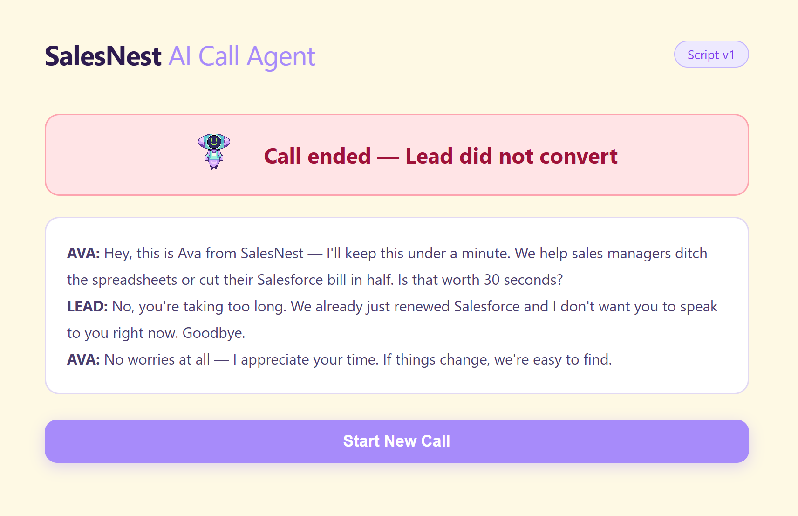
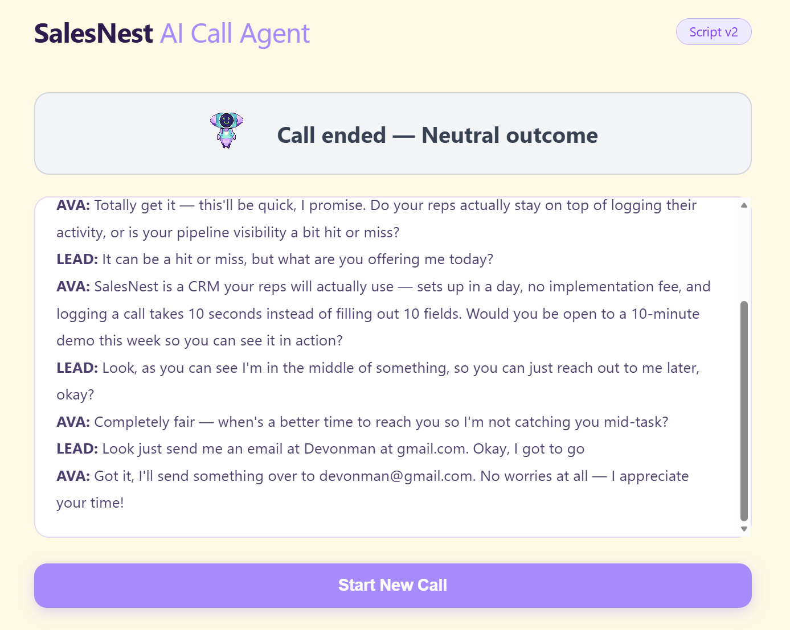
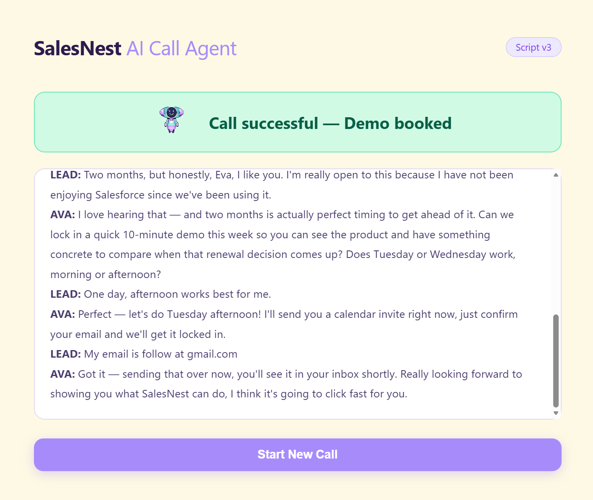
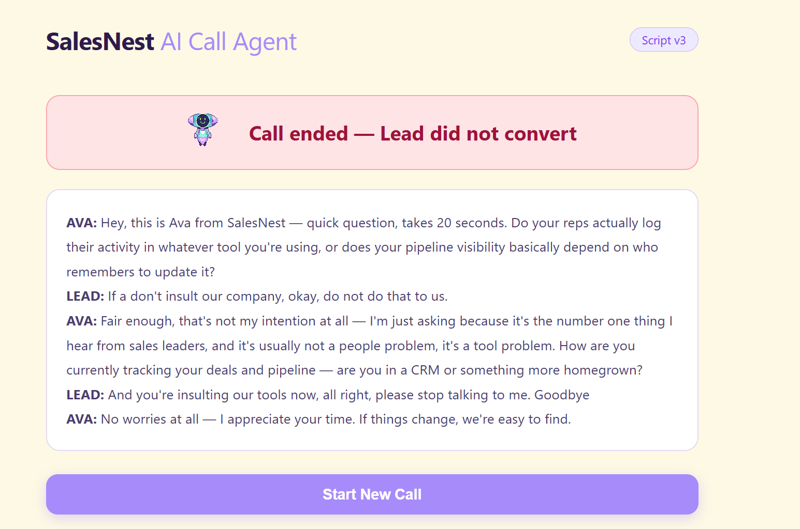

# Evaluation — Ava Improvement Loop Runs

Four calls were run back-to-back to demonstrate the improvement loop in action. The sequence was: fail → neutral → success → fail. Each failed or neutral call triggered the analyst and optimizer, producing a new script version. Here's what actually happened and what changed.

Please appreciate my acting skills in the roles of all the personas.

Please view any and all full transcripts and analysis logs too for further proof of concept, available in logs/transcripts/

---

## Run 1 — Failed (Script v1 → v2)

log viewable in logs/transcripts/call_20260410_011816.txt

**Persona:** Karen — VP of Sales, just renewed Salesforce  
**Outcome:** Failed — lead rejected the opener immediately

**Transcript highlight:**
> AVA: Hey, this is Ava from SalesNest — I'll keep this under a minute. We help sales managers ditch the spreadsheets or cut their Salesforce bill in half. Is that worth 30 seconds?
>
> LEAD: No, you're taking too long. We already just renewed Salesforce and I don't want to speak to you right now. Goodbye.

**What the analyst said:**
> Failure point: `opener` — Lead disengaged immediately. Test a sharper permission-based opener that leads with a compelling pain point before mentioning Salesforce to avoid triggering the "we already have it" reflex.

**What changed (v1 → v2):**

The opener got completely rewritten. v1 led with "ditch the spreadsheets or cut your Salesforce bill" which immediately triggered Karen since she had just renewed. v2 removes any direct product mention and instead opens with a question about rep behavior and pipeline visibility. The idea was to make it feel more conversational and get the lead thinking before giving them something to push back on.

| | v1 Opener | v2 Opener |
|---|---|---|
| **Before** | "We help sales managers ditch the spreadsheets or cut their Salesforce bill in half. Is that worth 30 seconds?" | — |
| **After** | — | "Do your reps actually log their activity in whatever tool you're using, or does your pipeline visibility basically depend on who remembers to update it?" |

---

## Run 2 — Neutral (Script v2 → v3)

log viewable in logs/transcripts/call_20260410_012059.txt

**Persona:** Devin — Sales Director, mid-quarter crunch  
**Outcome:** Neutral — reached the close but lead deflected to email

**Transcript highlight:**
> AVA: Would you be open to a 10-minute demo this week so you can actually see it in action?
>
> LEAD: Look, as you can see I'm in the middle of something, so you can just reach out to me later.
>
> LEAD: Look just send me an email at Devonman at gmail.com. Okay, I got to go.

**What the analyst said:**
> Failure point: `close` — When the lead asks to send an email, attempt to lock in a specific follow-up time before ending the call to avoid the email being ignored.

**What changed (v2 → v3):**

The close was adjusted to push for a time immediately instead of leaving it open-ended. In v2, the lead could easily say "just email me" and get out. v3 tightens that by suggesting actual days right away, which forces a softer commitment instead of letting the conversation die off.

| | v2 Close | v3 Close |
|---|---|---|
| **Before** | "Would you be open to a 10-minute demo this week — no pitch, just show you the product?" | — |
| **After** | — | "Would you be open to a 10-minute demo this week — no pitch, just show you the product? And while I have you — let's just lock in a time now so the email doesn't get buried. Does Tuesday or Wednesday work, morning or afternoon?" |

---

## Run 3 — Success (Script v3, no change)

log viewable in logs/transcripts/call_20260410_012459.txt

**Persona:** Rachel — Revenue Operations Head, leads 40 people  
**Outcome:** Success — demo booked

**Transcript highlight:**
> LEAD: Two months, but honestly, Ava, I like you. I'm really open to this because I have not been enjoying Salesforce since we've been using it.
>
> AVA: I love hearing that — and two months is actually perfect timing to get ahead of it. Can we lock in a quick 10-minute demo this week?
>
> LEAD: One day, afternoon works best for me.
>
> AVA: Perfect — let's do Tuesday afternoon! I'll send you a calendar invite right now, just confirm your email and we'll get it locked in.

The v3 script held up across the full conversation; the opener got the lead talking, the Salesforce objection was handled cleanly, and the updated close actually locked in a time instead of leaving it open. Nothing needed to be changed here; the optimizer flagged it as working.

**Analyst note:**
> Confirm specific day rather than "one day" to avoid scheduling ambiguity — minor edge case flagged for future iterations.

---

## Run 4 — Failed (Script v3 → v4)

log viewable in logs/transcripts/call_20260410_012858.txt

**Persona:** Karen (Again) - VP of Sales, just renewed Salesforce 
**Outcome:** Failed — lead took offense at the opener

**Transcript highlight:**
> AVA: Do your reps actually log their activity in whatever tool you're using, or does your pipeline visibility basically depend on who remembers to update it?
>
> LEAD: If you don't insult our company, okay, do not do that to us.
>
> AVA: Fair enough, that's not my intention at all...
>
> LEAD: And you're insulting our tools now, all right, please stop talking to me. Goodbye.

**What the analyst said:**
> Failure point: `opener` — Reframe the opener to lead with a positive value statement rather than a pain-point assumption that can feel presumptuous or critical to prospects sensitive about their current processes.

**What changed (v3 → v4):**

This one was funny to do in dismissing the v3 opener, it worked for the 'other persona' earlier but came off as too aggressive for Karen. The assumption-based phrasing sounded like a critique of their current process, which triggered a negative reaction. v4 shifts it to something more neutral and curiosity-driven; instead of assuming a problem, it frames it as something other teams are doing and invites the lead to engage without feeling called out.

| | v3 Opener | v4 Opener |
|---|---|---|
| **Before** | "Do your reps actually log their activity in whatever tool you're using, or does your pipeline visibility basically depend on who remembers to update it?" | — |
| **After** | — | "A lot of sales leaders we talk to have found ways to get real pipeline visibility without the usual CRM headaches — is that something that's on your radar right now?" |

---

## Summary

| Run | Script Used | Outcome | Section Changed | Version |
|---|---|---|---|---|
| 1 | v1 | Failed | Opener | → v2 |
| 2 | v2 | Neutral | Close | → v3 |
| 3 | v3 | Success | None | stays v3 |
| 4 | v3 | Failed | Opener | → v4 |

The loop worked exactly how it was supposed to; it only changed what was actually broken and left everything else alone, while still producing noticeably different responses each time. The biggest takeaway was that the same opener can work or fail depending on the persona, which is a pretty clear sign that a future version should account for that more directly.

**Please** be happy to reset the 'current_script.json' to the values of 'script_v1_wrapped.json' and delete the .jsons in versions (and .txt files in transcripts too) to experience the intial script and test it out for yourself!